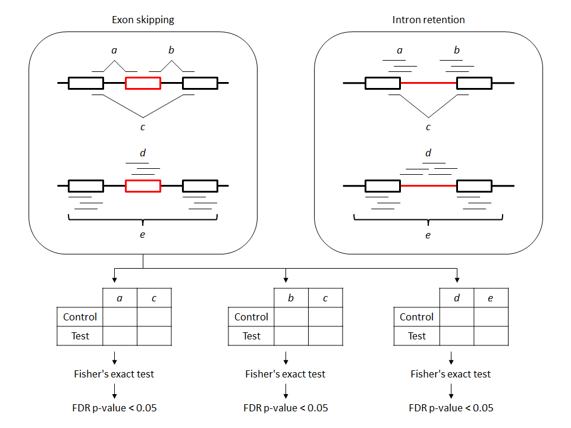

# SpliceFisher
Multiple Fisher's exact tests for differential alternative splicing detection using RNA-seq data


Method
------



1. Counting reads from BAM files
  - Exon skipping
    - *a*, *b* exon-junction reads
    - *c* exon-skipping reads
    - *d* exon-mapping reads
    - *e* gene-mapping reads
  - Intron retention
    - *a*, *b* exon-intron reads
    - *c* exon-exon reads
    - *d* intron-mapping reads
    - *e* gene-mapping reads
2. Fisher's exact test
  - (control *a* / control *c*) / (test *a* / test *c*)
  - (control *b* / control *c*) / (test *b* / test *c*)
  - (control *d* / control *e*) / (test *d* / test *e*)
3. Adjustment of p-values by false discovery rate (FDR) method


Requirements
------------

1. Perl - https://www.perl.org
2. Perl module "Bio::DB::Sam" - http://search.cpan.org/~lds/Bio-SamTools-1.43/lib/Bio/DB/Sam.pm
3. R - https://www.r-project.org
4. Common linux commands: cut, sort, uniq, ...


Install
-------

Install git (https://git-scm.com) before running the following command.
```
git clone https://github.com/jiwoongbio/SpliceFisher.git
```


Usages
------

1. Preparation of exon/intron regions
```
./prepare.sh <gene.gtf>
```
  - Example: Download Homo_sapiens_UCSC_hg19.tar.gz from http://support.illumina.com/sequencing/sequencing_software/igenome.html and unzip the file before running the following command.
```
./prepare.sh Homo_sapiens/UCSC/hg19/Annotation/Genes/genes.gtf
```
  - The repository contains prebuilt exon/intron regions in hg19.

2. Detection of differential alternative splicing
```
./SpliceFisher.sh <outputPrefix> <alpha> <control.bam> <test.bam>
```
  - Example: 
```
./SpliceFisher.sh Control_vs_hnRNPM_KD 0.05 Control_rep1.bam,Control_rep2.bam hnRNPM_KD_rep1.bam,hnRNPM_KD_rep2.bam
```
